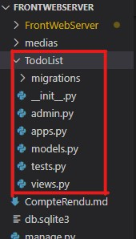
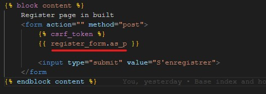

# Django 
 Django est un framework python open-source consacré au développement web 2.0 . Les concepteurs de Django lui ont attribué le slogan suivant: " Le framework web pour les perfectionnistes sous pression ". Il est donc clairement orienté pour les développeurs ayant comme besoin de produire un projet solide rapidement et sans surprise ... c'est à dire à tous les développeurs !

Comme il est toujours compliqué de partir de rien, Django vous propose une base de projet solide. Django est donc une belle boîte à outils qui aide et oriente le développeur dans la construction de ses projets. 

## Comprendre les migrations
### [Migration:](https://openclassrooms.com/fr/courses/7172076-debutez-avec-le-framework-django/7515281-sauvegardez-des-donnees-dans-une-base-de-donnees-avec-un-modele-et-une-migration#ui-id-8)
    Une migration est un ensemble d'instructions qui font passer notre base de données d'un état à un autre, par exemple en créant une nouvelle table. Nous pouvons utiliser le CLI de Django pour générer et exécuter les migrations à notre place

### [Modele:](https://openclassrooms.com/fr/courses/7172076-debutez-avec-le-framework-django/7515281-sauvegardez-des-donnees-dans-une-base-de-donnees-avec-un-modele-et-une-migration#ui-id-8)
    Un modèle définit les caractéristiques et les comportements d'un objet dont vous voulez garder la trace dans votre application. Il ressemble beaucoup à une classe standard, mais en plus, un modèle sait comment enregistrer (« persister ») ses données dans une base de données.

# Commencer la pratique 
## Création d'un projet sous django:
    Premiere il faux avoir Django d'installer pour vérifier cela dans un terminale entrer la commande "python -m django --version"

    Si vous obtener une version ces que c'est bien installer sinon executer la commande "python -m pip install Django" 
### Initialiser le projet
    Une fois django installer placer vous dans un répertoire de travaille puis ouvrir un terminal dans ce répertoire et éxécuter la commande:  "django-admin startproject NomDeVotreProjet"
    Une fois cet commande éxecuter un dossier avec le nom spécifier dans la commande est créer, dans ce fichier on va retrouver la structure minimal de votre app intialiser par Django. 

        NomDeVotreProjet/ (Conteneur de votre projet)
            manage.py     (Met à disposition la CLI de Django) (CLI => ligne de coommande)
            NomDeVotreProjet/ (Ce dossier )
                __init__.py (fichier vide qui dis a python de considerer ce dossier comme un Packet Python)
                settings.py (Retrouver dans ce fichier la configurations/paramètres de votre site/app)
                urls.py (Déclarer ici vos URL d'application ex: monsite.com/, monsite.com/contacte)
                asgi.py (System de déploiment avec ASGI)
                wsgi.py (System de déploiment avec WSGI)

## Executer les migrations:
    Une fois votre projet mis en place veuillez vous rendre dans son répertoire et entrer la commande: "python manage.py migrate"
    Cette commande auras pour objectif de créer un fichier .sqlite3 ce qui vas être notre base de données

## Créer un super utilisateur pour administrer la BDD:
    Une fois les migrations effecutuer il est important de créer un utilisateur administrateur pour gérer la base de données pour cela toujour dans votre terminal éxécuter la commande: "python manage.py createsuperuser".
    Une fois la commande éxécuter il vous seras demander de configurer l'utilisateur avec un [nom, email, mot de passe]

## Lancer le projet:
    A partir de maintenant vous pouvez lancer un serveur python qui vas heberger votre site web avec la commande "python manage.py runserver".

    Une fois la commande éxécuter rendez vous dans votre navigateur à l'addresse suivant : http://127.0.0.1:8000/

    Pour acceder à la gestion de votre BDD rendez vous sur http://127.0.0.1:8000/admin et connecter vous avec les identifiant spécifier

# Création d'une app pour le projet
    Il faut savoir que lorsque vous avez créé votre projet avec la commande startproject, Python à installer un système de configuration sous Django c'est à dire que tous les fichier .py dans le sous dossier du meme nom que votre projet sont des fichier de configuration pour pouvoir lancer des app créer sous ce projet.

    Pour créer un site web par example il faudrat créer une app avec la commande startapp.
    Pour cela toujours dans un termminal ouvert à la racine du projet lancer la commande "python manage.py startapp TodoList", ici pour créer un site web de todolist.

    Une fois la commande executer un dossier devrais être apparue dans votre projet comme si-dessus

    TodoList/
        __init__.py
        admin.py 
        apps.py
        migrations/ (Dans ce dossier déclarer les table de votre app, migrations = configurations des tables de la BDD)
            __init__.py
        models.py (Les modeles vont permettre d'initialisé les champs de données de vos tables)
        tests.py  (Pour faire des testes sur l'app "Teste Unitaire ?")
        urls.py   (Déclarer les URL de votre app)
        views.py  (Déclarer des controllers=>fonctions pour traiter les données et retourner une page en fonction de l'url)

## Créer ses models pour créer ses migration (créer des migration à partir des model)
    Pour créer un model rien de plus simple rendez vous dans le fichier models.py et definissez vos models.

    Pour créer une table utilisateur par example il faudras définir une classe dans notre fichier models.py tel que si dessous

    Il est possible d'ajouter autant de champs que nécessaire ici nous avons définis les champ name,email,pass ont peux aussi rajouter un champ role ou last_connexion

    Ensuite pour générer des migrations à partir de ces models dans un terminal entrer la commande:"python manage.py makemigration"

    Une fois les migrations créer il faux lancer la commande: "python manage.py migrate", pour peuplé la BDD avec la table User?

    Lorsque vous créé des migration à partir des models, toute vos classes déclarer en tant que models seront prise en compte pour la création des migrations.

## Les Formulaire
Les formulaire sont des outils très puissant qui permet de:

    - Créer des champs à completer (HTML)
    - Vérifier si les champs completer son bien les champs attendu (BACK-END)
    - Créer un formulaire en relation avec une entité de la BDD    (BACK-END)
        - Ce qui permet de vérifier si les champs entrés sont correspondants avec ceux attendu en BDD
        - D'enregistrer l'entité en BDD 

### Création d'un formulaire
Dans le dossier de votre app ici 'Site' créer un dossier 'formulaires' et à l'intérieur créer un fichier AuthenticationForm.py

Créons un formulaire d'enregistrement utilisateur.

Premierement il faux définir la class de son form extendu de django.forms.ModelForm

ensuite on y renseigne les champs du formulaire ici: email, username, password

### Relation form & model
Pour définir un formulaire en tant que formulaire de d'insertion en BDD il suffit de rajouter la 'class Meta'

et d'y définir le model sur lequel pointer en BDD pour la comparaison des champs ainsi que les champs à récuperer venant du formulaire

### Instancier le formulaire (backend to frontend)
Dans le views de votre page ou afficher le formulaire instancier le, en fonction du type de requête faite vos operation avec le formulaire et enfin passer le en paramètres de rendus:

Au niveaux du frontend pour afficher les entrer du formulaire:

